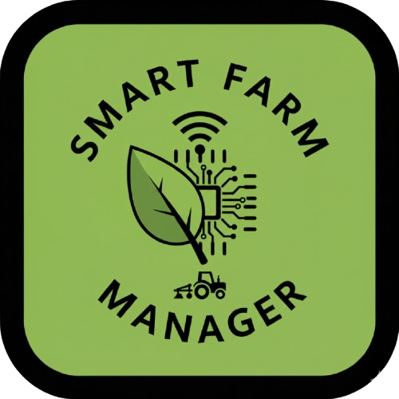

<div align="center">
  
  
  # 🌾 Smart Farm Manager
  
  ### *Your All-in-One Farm Management Solution*
  
  [](https://nextjs.org/)
  [](https://reactjs.org/)
  [](https://www.typescriptlang.org/)
  [](https://www.mongodb.com/)
  [](https://tailwindcss.com/)
  
  [Features](#-features) • [Tech Stack](#-tech-stack) • [Getting Started](#-getting-started) • [Architecture](#-architecture) • [Screenshots](#-screenshots)
  
</div>

---

## 📖 Overview

**Smart Farm Manager** is a comprehensive ERP (Enterprise Resource Planning) system designed specifically for modern farm operations. Built with cutting-edge web technologies, it provides farmers and agricultural businesses with powerful tools to manage their fields, crops, animals, equipment, and workforce—all in one intuitive platform.

Whether you're managing a small family farm or a large agricultural enterprise, Smart Farm Manager streamlines your operations with real-time data tracking, interactive analytics, and seamless resource management.

---

## ✨ Features

### 🧑‍🌾 **Farmer Management**

- Complete CRUD operations for farmer profiles
- Role-based access control
- Farmer performance tracking
- Contact information management

### 🌱 **Field Management**

- Track multiple farm fields with detailed information
- Monitor soil types and field conditions
- Location-based field organization
- Area calculations and field analytics
- Interactive field mapping

### 🌾 **Crop Management**

- Comprehensive crop lifecycle tracking
- Planting and harvest date management
- Crop type categorization
- Field-to-crop relationships
- Growth stage monitoring

### 🐄 **Animal Inventory**

- Complete livestock management system
- Individual animal tracking with unique tags
- Health status monitoring
- Birth date and weight tracking
- Species categorization
- Farmer-animal assignments

### 🚜 **Equipment Tracking**

- Maintain equipment inventory
- Track purchase and service dates
- Monitor equipment status (active, maintenance, retired)
- Service history and maintenance scheduling
- Equipment-to-farmer assignments

### 📊 **Advanced Analytics**

- **Interactive Data Visualizations** powered by Nivo
  - Bar charts for top performers
  - Pie charts for distribution analysis
  - Line charts for trends over time
- **Filterable Dashboards**
  - Filter by location, type, farmer, and more
  - Real-time data updates
  - Export capabilities
- **Key Performance Indicators (KPIs)**
  - Total area under cultivation
  - Average field sizes
  - Equipment utilization rates
  - Animal health statistics
  - Top-performing farmers

### 🎨 **Modern UI/UX**

- **Neobrutalism Design System** - Bold, clean, and distinctive
- **Dark Mode Support** - Seamless theme switching
- **Responsive Layout** - Works on desktop, tablet, and mobile
- **Accessible Components** - Built with Radix UI primitives
- **Interactive Tables** - Sortable, filterable, and paginated data tables

---

## 🛠 Tech Stack

### **Frontend**

- **[Next.js 16.0](https://nextjs.org/)** - React framework with App Router
- **[React 19.2](https://reactjs.org/)** - UI library
- **[TypeScript 5.0](https://www.typescriptlang.org/)** - Type-safe development
- **[TailwindCSS 4.0](https://tailwindcss.com/)** - Utility-first CSS framework
- **[Radix UI](https://www.radix-ui.com/)** - Accessible component primitives
- **[shadcn/ui](https://ui.shadcn.com/)** - Beautifully designed components

### **State Management & Data Fetching**

- **[TanStack Query (React Query)](https://tanstack.com/query)** - Powerful data synchronization
- **[React Hook Form](https://react-hook-form.com/)** - Performant form management
- **[Zod](https://zod.dev/)** - TypeScript-first schema validation

### **Data Visualization**

- **[Nivo](https://nivo.rocks/)** - Feature-rich charting library
  - Responsive Bar Charts
  - Interactive Pie Charts
  - Line Charts
  - Custom themes for dark/light modes

### **Backend & Database**

- **[Next.js API Routes](https://nextjs.org/docs/app/building-your-application/routing/route-handlers)** - Serverless API endpoints
- **[MongoDB](https://www.mongodb.com/)** - NoSQL database
- **[Mongoose](https://mongoosejs.com/)** - MongoDB object modeling
- **[Docker](https://www.docker.com/)** - Containerized database deployment

### **UI Components & Utilities**

- **[Lucide React](https://lucide.dev/)** - Beautiful icon library
- **[Sonner](https://sonner.emilkowal.ski/)** - Toast notifications
- **[Day.js](https://day.js.org/)** - Date manipulation
- **[class-variance-authority](https://cva.style/)** - Component variants
- **[TanStack Table](https://tanstack.com/table)** - Powerful table utilities

---

## 🚀 Getting Started

### Prerequisites

- **Node.js** 18+ and npm/yarn/pnpm
- **Docker** (for MongoDB container)
- **Git**

### Installation

1. **Clone the repository**

   ```bash
   git clone https://github.com/yourusername/smart-farm-manager.git
   cd smart-farm-manager
   ```

2. **Start MongoDB with Docker**

   ```bash
   docker-compose up -d
   ```

   This will start a MongoDB container exposed on port `27017`.

3. **Install dependencies**

   ```bash
   cd smart-farm-manager
   npm install
   # or
   yarn install
   # or
   pnpm install
   ```

4. **Set up environment variables**

   Create a `.env.local` file based on `.env.example`:

   ```bash
   cp env.example .env.local
   ```

   Update with your MongoDB connection string if needed.

5. **Run the development server**

   ```bash
   npm run dev
   # or
   yarn dev
   # or
   pnpm dev
   ```

6. **Open your browser**

   Navigate to [http://localhost:3000](http://localhost:3000)

### Verify MongoDB Connection

```bash
docker exec -it fitness-mongodb mongosh
```

---

## 🏗 Architecture

### Project Structure

```
smart-farm-manager/
├── src/
│   ├── app/                    # Next.js App Router
│   │   ├── api/               # API routes
│   │   │   ├── animals/
│   │   │   ├── crops/
│   │   │   ├── equipments/
│   │   │   ├── farmers/
│   │   │   └── fields/
│   │   ├── animals/           # Animal management pages
│   │   ├── crops/             # Crop management pages
│   │   ├── equipments/        # Equipment management pages
│   │   ├── farmers/           # Farmer management pages
│   │   ├── fields/            # Field management pages
│   │   ├── layout.tsx         # Root layout
│   │   └── page.tsx           # Home page
│   ├── components/
│   │   ├── features/          # Feature-specific components
│   │   │   ├── animals/
│   │   │   ├── crops/
│   │   │   ├── equipments/
│   │   │   ├── farmers/
│   │   │   └── fields/
│   │   └── ui/                # Reusable UI components
│   ├── lib/                   # Utility libraries
│   │   ├── mongodb.ts         # Database connection
│   │   └── utils.ts           # Helper functions
│   ├── models/                # MongoDB models
│   │   ├── Animal.ts
│   │   ├── Crop.ts
│   │   ├── Equipment.ts
│   │   ├── Farmer.ts
│   │   └── Field.ts
│   ├── providers/             # React context providers
│   │   ├── LayoutProvider.tsx
│   │   ├── QueryClient.tsx
│   │   └── ThemeProvider.tsx
│   └── utils/                 # Utilities and hooks
│       ├── constants.ts
│       ├── routes.ts
│       └── hooks/             # Custom React hooks
├── public/                    # Static assets
├── docker-compose.yml         # Docker configuration
└── package.json
```

### Data Models

#### **Farmer**

- `_id`, `name`, `email`, `password`, `role`

#### **Field**

- `_id`, `name`, `area`, `location`, `soil_type`, `farmer_id`

#### **Crop**

- `_id`, `name`, `type`, `planting_date`, `harvest_date`, `field_id`

#### **Animal**

- `_id`, `tag`, `species`, `birth_date`, `weight`, `health_status`, `farmer_id`

#### **Equipment**

- `_id`, `name`, `type`, `status`, `purchase_date`, `last_service_date`, `farmer_id`

---

## 🎨 Design System

Smart Farm Manager features a **Neobrutalism-inspired design** with:

- **Bold borders** - Strong 2px black borders
- **Clean shadows** - Subtle offset shadows for depth
- **High contrast** - Clear visual hierarchy
- **Rounded corners** - Modern, friendly appearance
- **Consistent spacing** - Harmonious layouts
- **Dark mode** - Full theme support with automatic detection

---

## 📸 Screenshots

> _Add your application screenshots here_

---

## 🔮 Roadmap

- [ ] Task management system with field assignments
- [ ] Expense tracking and financial reports
- [ ] Weather integration for field planning
- [ ] Mobile application (React Native)
- [ ] Multi-language support
- [ ] PDF report generation
- [ ] Email notifications
- [ ] Advanced permissions system
- [ ] Integration with IoT sensors

---

## 🤝 Contributing

Contributions are welcome! Please feel free to submit a Pull Request.

1. Fork the project
2. Create your feature branch (`git checkout -b feature/AmazingFeature`)
3. Commit your changes (`git commit -m 'Add some AmazingFeature'`)
4. Push to the branch (`git push origin feature/AmazingFeature`)
5. Open a Pull Request

---

## 📄 License

This project is licensed under the MIT License - see the LICENSE file for details.

---

## 👨‍💻 Author

**Cosmin Saracil**

---

## 🙏 Acknowledgments

- [Next.js](https://nextjs.org/) for the amazing framework
- [shadcn/ui](https://ui.shadcn.com/) for beautiful components
- [Nivo](https://nivo.rocks/) for data visualization
- [Neobrutalism Design](https://www.neobrutalism.dev/) for design inspiration

---

<div align="center">
  
  **Made with ❤️ for farmers and agricultural businesses**
  
  ⭐ Star this repo if you find it helpful!
  
</div>
